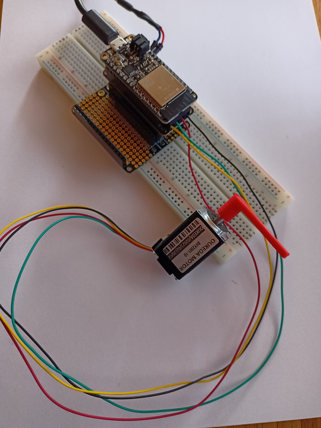

# Unused PoC

- [NEMA8 Stepper Motor](#nema8-stepper-motor)
- [Automotive Gauge](#automotive-gauge)
- [Small Reduction Stepper Motor](#small-reduction-stepper-motor)
- [TT DC Gearbox Motor 1:48](#tt-dc-gearbox-motor-148) 

## NEMA8 Stepper Motor

### Software
- Arduino IDE > Examples > Adafruit Motor Shield V2 > StepperTest 
  - [GitHub](https://github.com/adafruit/Adafruit_Motor_Shield_V2_Library/blob/master/examples/StepperTest/StepperTest.ino)

### Hardware
- [ESP32 Feather Board](https://www.adafruit.com/product/3591)
- [Feather Wing Doubler](https://www.adafruit.com/product/2890)
- [NEMA8 Stepper Motor](https://www.adafruit.com/product/4411) 
  - up to 3.9V 600mA
  - 200 Steps (1.8 deg per step)
- [Assembled DC Motor + Stepper FeatherWing Add-on](https://www.adafruit.com/product/3243) (or any other appropriate stepper driver)
  - Runs motors between 4.5 - 13.5V 1.2A
- Power Supply 4.5 - 5V
- Breadboard
#### Additional Information
- Since you can use a stepper driver with or without current limiting, pay attention to your power supply.
- _From Adafruit:_ If you have a non-current-limiting driver such as the motor shield/hat/feather we found 5V DC power worked well to power the stepper controller.

### Enclosure 
- tbd
 
## Automotive Gauge

### Software
- Arduino IDE > Examples > Stepper > oneRevolution 
  - TB6612 to ESP32: 23-AIN2, 22-AIN1, 14-BIN1, 32-BIN2

### Hardware
- [ESP32 Feather Board](https://www.adafruit.com/product/3591)
- [Automotive Gauge Stepper](https://www.adafruit.com/product/2424)
  - 600 Steps (0.525 deg per step)
  - Range 315 deg
- [Adafruit TB6612 1.2A DC/Stepper Motor Driver](https://www.adafruit.com/product/2448) (or any other appropriate stepper driver)
  - Runs motors between 4.5 - 13.5V 1.2A
  - Logic 2.7 - 5V
- Power Supply 5V
- Breadboard
 
### Enclosure
- tbd

## Small Reduction Stepper Motor

### Software
- Arduino IDE > Examples > Stepper > oneRevolution
  - TB6612 to ESP32: 23-AIN2, 22-AIN1, 14-BIN1, 32-BIN2

### Hardware
- [ESP32 Feather Board](https://www.adafruit.com/product/3591)
- [Small Reduction Stepper Motor ](https://www.adafruit.com/product/858)
  - 32 Steps with 1/16 reduction gear (516 Steps ~0.7 deg per step)
  - 5V
- [Adafruit TB6612 1.2A DC/Stepper Motor Driver](https://www.adafruit.com/product/2448) (or any other appropriate stepper driver)
  - Runs motors between 4.5 - 13.5V 1.2A
  - Logic 2.7 - 5V
- Power Supply 5V
- Breadboard

### Enclosure
- tbd

## TT DC Gearbox Motor 1:48

### Software
- Arduino IDE > Just write `analogWrite(value)` to `A0` or `A1`
  - L9110H to ESP32: A0 - IA, A1 - IB
  - One Pin per direction (PWM)

### Hardware
- [ESP32 Feather Board](https://www.adafruit.com/product/3591)
- [TT DC Gear Motor](https://www.adafruit.com/product/3777)
  - DC Motor 
  - 3-6V
- [L9110H H-bridge driver](https://www.adafruit.com/product/4489) (or any other appropriate motor driver)
  - [Datasheet](https://cdn-shop.adafruit.com/product-files/4489/4489_datasheet-l9110.pdf)
  - Runs motors between 2.5 - 12V 800mA
- Power Supply 5V
- Breadboard

### Enclosure
- tbd
